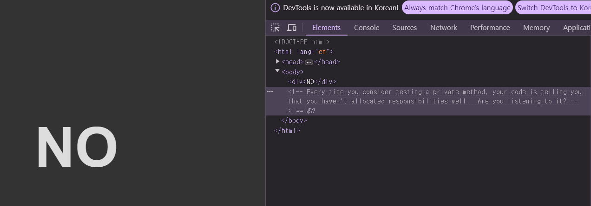
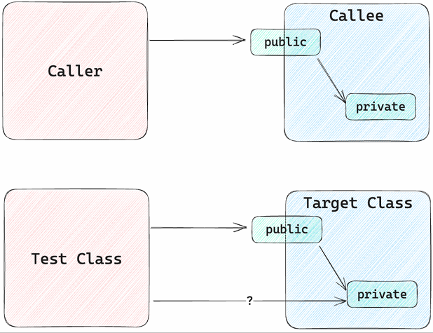

# Private Method Test
private 메서드는 테스트를 해야할까?  
https://shoulditestprivatemethods.com 이 사이트로 들어가면 정답이 있다.  
  
사이트에 접속하면 NO 라는 글자가 나오고, 개발자 도구를 열면 주석으로 비공개 메서드 테스트를 고려할 때마다 코드에서는 책임을 제대로 할당하지 않았다는 메세지를 표사한다. 라는 문구가 적혀있다. private 메서드는 테스트하면 안된다는 뜻이다.  

## 그래서 테스트하면 왜 안 되어요??
private 메서드를 테스트하면 안되는 이유는 테스트 대상이 되는 클래스 입장에서 테스트 클래스는 일반적인 클래스들과 마찬가지로 caller에 해당한다. caller에게 private 메서드를 노출하지 않는 것처럼 또한 테스트 클래스에게도 private 메서드를 노출하지 않아야한다.  
테스트의 대상은 상세한 구현이 아닌 동작이 되어야 하며, private 메서드에 대한 테스트가 들어간다면, 구현이 변경될 때마다 테스트를 재작성 해야한다.  
    
쉽게 말해서 private 메서드는 구현의 영역이지, 테스트의 대상이 아니라는 뜻이며, 일반적으로 private 메서드로 구현을 하면 다른 caller에서 직접 접근이 안되는것처럼 Test Class에서도 마찬가지로 적용이 되어야 한다는 말이다.  

## 테스트 방법 3가지
private 메서드를 테스트 하는건, 안좋은 방법이지만 그럼에도 불구하고 테스트를 해야하는 경우에 3가지 방법을 사용할 수 있다.

## Java Reflection
Java Reflection의 getDeclaredMethod를 사용하여 **private 메서드에 접근**한다. 메서드 이름과 인자 타입들을 가변인자로 전달하고 해당하는 메서드를 찾지 못하면 NoSuchMethodException이 발생한다.  
setAccessible을 통해서 private 메서드를 접근 가능하게 변경할 수 있고, 그 이후 특정 객체와 인자들을 invoke에 전달하여 실행한다.
````java
public class PrivateTestReflectionTest {
    @SneakyThrows
    @Test
    void test1() {
        GreetingService greetingService = new GreetingService();

        Method privateMethod = greetingService.getClass()
                .getDeclaredMethod("prepareGreeting", String.class);

        privateMethod.setAccessible(true);

        String greeting = (String)privateMethod.invoke(
                greetingService, "world"
        );

        assertEquals("hello world", greeting);
    }
}
````
위처럼 private Reflection을 사용해서 메서드를 테스트는 가능하지만, prepareGreeting 이라는 메서드의 구현이 변경되면 테스트를 다시 작성해야한다.  

## Spring ReflectionTestUtils
Spring ReflectionTestUtils은 다양한 ReflectionUtils 메서드를 제공한다. private 메서드, 필드에도 모두 동작 가능하다.  
setField: 특정 필드에 값을 설정한다.  
getField: 특정 필드의 값을 조회한다.  
invokeGetterMethod : 필드 이름의 주어지면 이를 기반으로 getter 메서드를 탐색하여 실행하고 결과를 반환한다.  
invokeSetterMethod : 필드 이름과 값이 주어지면 이를 기반으로 setter 메서드를 실행한다.  
invokeMethod : 주어진 이름을 갖는 메서드를 실행하고 인자를 전달한다.  
````java
public class PrivateTestReflectionTestUtilsExampleTest {
    @SneakyThrows
    @Test
    void test1() {
        GreetingService greetingService = new GreetingService();

        String greeting = ReflectionTestUtils.invokeMethod(
                greetingService,
                "prepareGreeting",
                "world"
        );
        assertEquals("hello world", greeting);

        Integer count = (Integer) ReflectionTestUtils.getField(greetingService, "count");
        assertEquals(100, count);

        ReflectionTestUtils.setField(greetingService, "count", 1000);

        count = (Integer) ReflectionTestUtils.getField(greetingService, "count");
        assertEquals(1000, count);

        ReflectionTestUtils.invokeSetterMethod(greetingService, "count", 10000, Integer.class);

        count = (Integer) ReflectionTestUtils.getField(greetingService, "count");

        assertEquals(10000, count);
    }
}
````
Spring ReflectionTestUtils에서 제공하는 invokeMethod를 사용하면 간단하게 private 메서드를 테스트하고, private인 getter와 setter로도 캡슐화 되어 있는 데이터에도 접근해서 테스트를 진행할 수 있다.  

## Method Object 
Java Reflection, Spring ReflectionTestUtils 두개의 방법으로 private 메서드를 테스트는 할 수 있지만, private 메서드를 바꾸지 못하고 테스트를 진행해야 한다는 한계점이 존재한다.  
'메서드 객체' 패턴을 사용해서 테스트를 진행하면 private 메서드를 **클래스로 분리**하고 public 메서드를 생성할 수 있고 기존 private 메서드를 사용하던 클래스는 private 메서드 대신 객체를 호출하여 실행한다.

````java

import lombok.RequiredArgsConstructor;
import lombok.extern.slf4j.Slf4j;


// 기존 GreetingService의 private 메서드
private String prepareGreeting(String who) {
    return "hello " + who;
}

@RequiredArgsConstructor
public class GreetingGenerator {
    private final String who;

    public String execute() {
        return "hello" + who;
    }
}

@Slf4j
public class GreetingSeparatedService {
    public void hello(String who) {
        String greeting = new GreetingGenerator(who).execute();
        log.info(greeting);
    }
}
````
기존 GreetingService의 prepareGreeting private 메서드를 GreetingGenerator 객체로 변경하고, 생성자와 execute public 메서드를 포함한다.  
구현은 동일하게 되어있지만, GreetingGenerator의 execute 메서드는 public 메서드로서 동작하게 된다.   
가장 큰 차이점은 who 값을 인자로 넘겨주지 않고 생성자로 넘겨주었다는 점이고, GreetingGenerator를 생성할때 who 값을 넘겨주면 바로 execute를 실행할 수 있게 된다. 
````java
public class MethodObjectTest {
    @Test
    void test1() {
        String who = "world";
        GreetingGenerator greetingGenerator = new GreetingGenerator(who);

        String expected = "hello " + who;
        assertEquals(expected, greetingGenerator.execute());
    }
}
````
이렇게 메서드 패턴으로 public 화 시켜서 사용하면 private 메서드에 접근하지 않고 테스트를 진행 할 수 있다.