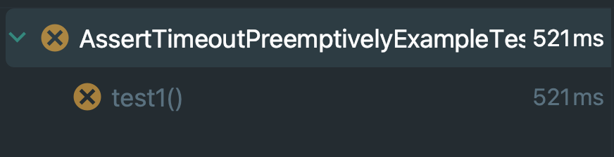

## Assertions에서 제공하는 실행 메서드
실행 기반의 Assertions란 익셉션을 Throw 했는지, 혹은 Exception을 Throw 하지 않고 제대로 통과가 되었는지를 확인할 수 있는 메서드다.

## assertAll
여러 Executable을 인자로 받고 실행하여 모든 Executable이 Exception을 throw하지 않는지 검증한다. 이 때, Exception을 throw하는 Executable이 하나라도 있다면 실패처리되며 여러 Executable을 가변인자, Collection, Stream 형태로 전달한다.  

````java
import com.example.springtest.jUnit.assertions.comparison.annotation.TestToFail;
import org.junit.jupiter.api.Test;
import org.junit.jupiter.api.function.Executable;


import java.util.stream.Stream;

import static org.junit.jupiter.api.Assertions.*;

public class AssertAllExampleTest {
    @Test
    void test1() {
        assertAll(
                () -> {
                },
                () -> {
                },
                () -> {
                }
        );
    }

    @TestToFail
    void test2() {
        Stream<Executable> executables = Stream.of(
                () -> {
                },
                () -> {
                    throw new IllegalStateException();
                }
        );
        assertAll(executables);
    }
}
````
test1 에서는 가변인자 형태로 Executable을 lambda로 전달한다. test2에서는 Stream 형태로 전달하지만 exception을 throw하는 lambda가 있기 때문에 test는 fail처리 된다.

## assertThrows(Exactly)
인자로 주어진 Executable을 실행하여 특정 Exception을 throw 하는지 검증한다. 만약 Exception 클래스가 정확하게 특정 클래스 타입인지 확인해야 한다면 assertExactly를 사용하며, assertThrows는 throw된 Exception이 주어진 Exception을 상속 혹은 구현하고 있어도 통과된다.  
````java
import org.junit.jupiter.api.Test;

import static org.junit.jupiter.api.Assertions.*;

public class AssertThrowsExampleTest {
    @Test
    void test1() {
        assertThrows(
                IllegalStateException.class,
                () -> { throw new IllegalStateException(); }
        );
    }

    @Test
    void test2() {
        assertThrows(
                RuntimeException.class,
                () -> { throw new IllegalStateException(); }
        );
    }

    @Test
    void test3() {
        assertThrows(
                IllegalStateException.class,
                () -> { throw new RuntimeException(); }
        );
    }

}
````
test1 에서는 정확히 같은 클래스가, test2 에서는 부모 클래스가 주어졌기 때문에 테스트는 통과되지만 test3은 RuntimeException은 IllegalStateException을 자식으로 가지고 있지, 부모로 가지고 있는게 아니기 때문에 테스트는 실패처리 된다.
assertInstanceOf 와 유사한 패턴이다.

````java
import com.example.springtest.jUnit.assertions.comparison.annotation.TestToFail;
import org.junit.jupiter.api.Test;

import static org.junit.jupiter.api.Assertions.*;


public class AssertThrowsExactlyExample {

    @Test
    void test1() {
        assertThrowsExactly(
                IllegalStateException.class,
                () -> {
                    throw new IllegalStateException();
                }
        );
    }

    @TestToFail
    void test2() {
        assertThrowsExactly(
                RuntimeException.class,
                () -> {
                    throw new IllegalStateException();
                }
        );
    }
}
````
assertThrowsExactly 는 assertThrows보다 더 엄격하게 클래스가 같은지를 체크한다. RuntimeException과 IllegalStateExcpetion이 정확하게 일치하는 Exception인지를 체크하고 아니라면 테스트는 fail 처리 된다.

## assertDoesNotThrow
Exception이 throw되지 않아야 하는 경우에 사용한다. 인자로 주어진 Executable 혹은 ThrowingSupplier를 실행하고 Exception을 throw하지 않는지 검증한다.  
ThrowingSupplier는 값을 반환하고 Executable은 반환이 불가능하며, 이를 통해 ThrowingSupplier에서 반환한 결과를 바로 테스트에 사용 가능하다.  

````java

import com.example.springtest.jUnit.assertions.comparison.annotation.TestToFail;
import org.junit.jupiter.api.Test;

import static org.junit.jupiter.api.Assertions.assertDoesNotThrow;
import static org.junit.jupiter.api.Assertions.assertEquals;

public class AssertDoesNotThrowExample {
    
    @Test
    void test1() {
        assertDoesNotThrow(
                () -> {}
        );
    }

    @Test
    void test2() {
        Integer result = assertDoesNotThrow(
                () -> { return 1; }
        );
        assertEquals(1, result);
    }

    @TestToFail
    void test3() {
        assertDoesNotThrow(
                () -> { throw new IllegalStateException(); }
        );
    }
}

````
test1은 아무런 Exception을 Throw하지 않고 있기 때문에 테스트틑 pass처리 된다.  
test2에서 ThrowingSupplier를 통해 반환된 결과를 assertEquals로 비교한다. 반환되는 결과는 특정 메서드의 반환값이여도 되며 특정 값이 아니라 어떤 값을 반환 받아서 특정 로직을 수행할 수 있다는게 중요하다.   
test3에서는 IllegalStateException을 throw 시켜서 test는 fail 처리 된다.

## assertTimeout
Executable 혹은 ThrowingSupplier를 실행하고 실행 시간이 주어진 Duration을 넘지 않는지를 검증하는 메서드다.  
인자로 주어지는 Executable은 주어지는 Duration보다 반드시 더 짧은 시간내에 종료가 되어야 한다. ThrowingSupplier를 이용하여 반환한 결과를 바로 테스트에 사용 가능하다.  

````java

import org.junit.jupiter.api.Test;

import java.time.Duration;

import static org.junit.jupiter.api.Assertions.assertEquals;
import static org.junit.jupiter.api.Assertions.assertTimeout;

public class AssertTimeoutExampleTest {
    @Test
    void test1() {
        var duration = Duration.ofSeconds(1);
        assertTimeout(duration, () -> {
            Thread.sleep(500);
        });
    }

    @Test
    void test2() {
        var duration = Duration.ofSeconds(1);
        Integer result = assertTimeout(duration, () -> {
            Thread.sleep(500);
            return 1;
        });
        assertEquals(1, result);
    }

    @TestToFail
    void test3() {
        var duration = Duration.ofMillis(500);
        assertTimeout(duration, () -> {
            Thread.sleep(1000);
        });
    }
}
````
test1 에서 1초 안에 끝나길 기대하고, Executable은 500ms 만에 끝나기 때문에 pass되고 test2에서 반환된 결과를 다른값과 비교한다.  
test3에서 500ms 안에 끝나길 기대하지만 Executable은 1초가 걸리기 때문에 테스트는 실패처리 된다.

## assertTimeoutPreemptively
assertTimeout을 사용해서 시간을 검증하면, Duration이 지나도 Executable을 종료하지 않고 계속 실행하고 있는 모습을 볼 수 있는데, 이는 테스트 원칙 fast를 지키지 못하게 되는 원인이 될 수 있다.  
따라서 Duration이 지나는 시점에 Executable 혹은 ThrowingSupplier를 종료하고 싶다면 assertTimeoutPreemptively 를 사용해야 한다.

  
test3은 500ms 을 기대값으로 넣었지만 1초가 초과된 확인할 수 있다. 지금은 예제여서 짧은시간이 초과되었지만 실무였다면 훨씬 오래 기다릴수도있다.


````java
import com.example.springtest.jUnit.assertions.comparison.annotation.TestToFail;

import java.time.Duration;
import static org.junit.jupiter.api.Assertions.*;

public class AssertTimeoutPreemptivelyExampleTest {
    @TestToFail
    void test1() {
        var duration = Duration.ofMillis(500);
        assertTimeoutPreemptively(duration, () -> {
            Thread.sleep(1000);
        });
    }
}
````
  
assertTimeoutPreemptively를 사용 후 실행결과를 보면 Duration으로 설정한 값 근처로 바로 테스트가 종료된다. 실행시간을 줄이고 전체적인 테스트 시간을 빠르게 하려면 assertTimeoutPreemptively를 사용하도록 하자.