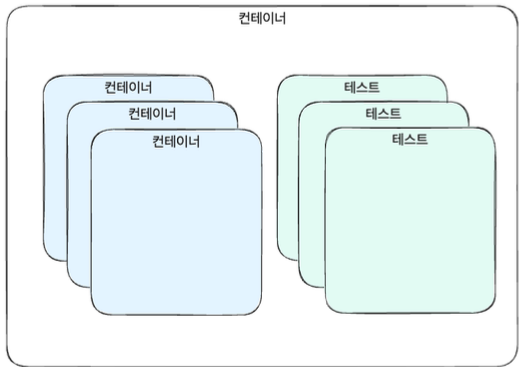
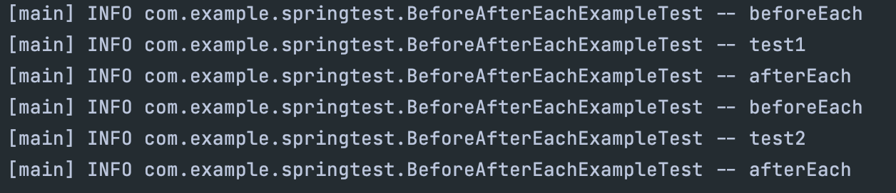
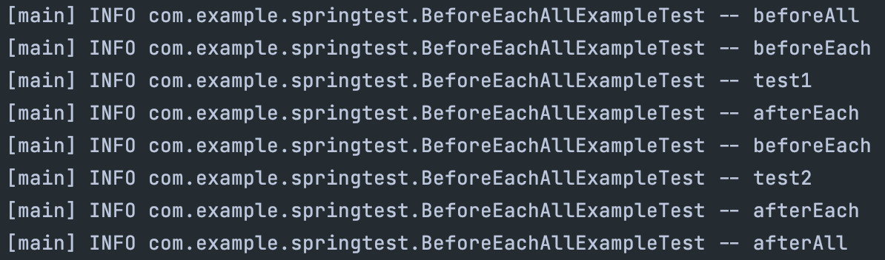
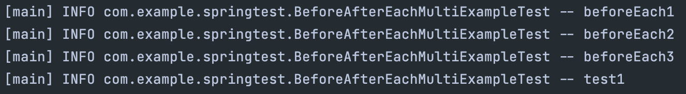
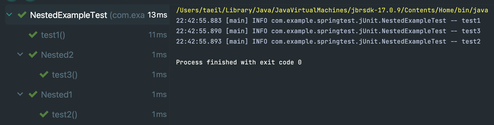
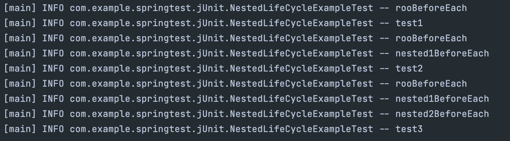

## JUnit
Java에서 가장 많이 사용되는 테스트 프레임워크이며, 테스트에 필요한 기능들을 제공하고 테스트 시나리오 작성을 지원한다.  
JUnit5는 JUnit Platform, JUnit Jupiter, JUnit Vintage로 구성된다.

### JUnit Platform
JVM에서 테스트 프레임워크를 실행하기 위한 기반을 제공한다.  
개발자가 작성한 테스트를 찾고 실행 계획을 생성하는 TestEngine 인터페이스가 정의되어 있고, 이를 기반으로 JUnit의 버전과 상관없이 테스트 실행이 가능하다.  
IDE, 빌드툴, 등도 함께 지원한다.

### JUnit Jupiter
JUnit의 버전이 변경되면 해당 버전만의 기능이나 어노테이션 등을 제공하는 역할을 하는게 JUnit Jupiter의 역할이다.  
JUnit Platform의 TestEngine 인터페이스를 구현하여 테스트를 제공한다.
  
### JUnit Vintage
JUnit3, 4로 작성된 테스트를 실행할 수 있게 JUnit Platform의 TestEngine을 구현하여 JUnit5에서도 JUnit 3,4의 테스트가 실행될 수 있게 해주는 모듈이다.  
이전 버전의 테스트도 유지보수가 가능하게 해주는 모듈.  

## 제공되는 어노테이션
JUnit은 어노테이션을 기반으로 테스트를 작성하고 확장한다. 크게 4가지로 분류할 수 있는데,  
1. 테스트와 생명 주기 : @Test, @BeforeEach, @AfterEach, @BeforeAll, @AfterAll, @Nested
2. 유틸리티 : @DisplayName, @Tag
3. 실행 조건 : @Disabled, @DisabledOn*, @EnabledOn*
4. 테스트 종류 : ParameterizedTest, @RepeatedTest

어노테이션 기반으로 테스트를 작성하다 보면, 복붙을 한다던가 기존 테스트에 추가를 한다거나 할때 실수로 잘못 입력한다거나 하는 문제가 발생할 수 있다.  
이러한 문제점을 보완하기 위해 JUnit은 메타-어노테이션 기능을 제공한다.  

메타-어노테이션은 어노테이션을 상속할 수 있는 기능을 말하며, 다양한 어노테이션을 갖는 새로운 어노테이션을 생성하여 재활용이 가능하다.

````java
import java.lang.annotation.ElementType;
import java.lang.annotation.Retention;
import java.lang.annotation.RetentionPolicy;
import java.lang.annotation.Target;
import static org.junit.jupiter.api.Assertions.assertEquals;

@Target(ElementType.METHOD)
@Retention(RetentionPolicy.RUNTIME)
@Tag("slow")
@Test
public @interface SlowTest { }

@SpringBootTest
public class TestA {
    void test() {
        assertEquals(1,1);
    }
````
SlowTest 라는 어노테이션을 정의해서, 어플리케이션에 많은 테스트들을 한번에 Disabled 시키고 싶다면, SlowTest 내가 정의한 어노테이션에 @Disabled를 적용하면 전체 적용이 가능해진다.

## 컨테이너와 테스트
컨테이너는 다른 컨테이너 혹은 테스트들을 포함하는 **노드**로, 테스트 클래스가 이에 해당된다. 하나의 컨테이너 안에 또 다른 컨테이너가 들어가고, 그 컨테이너 안에는 테스트 단위가 들어가게된다.  
이렇게 중첩으로 여러개의 컨테이너, 테스트를 포함하는게 컨테이너이다.
테스트는 실행된 결과가 기대와 일치하는지 검증하는 **노드**로 @Test를 포함하고 있는 테스트 메서드에 해당한다.  
  

## 테스트 클래스와 메서드, 수명주기
테스트 클래스 : 적어도 하나 이상의 테스트 메서드를 포함하는 클래스, 최상위 클래스, static, @Nested를 포함하는 자식 클래스 모두 포함한다.  
테스트 메서드 : 테스트를 실행하는 메서드로, @Test, @RepeatedTest, @ParameterizedTest, @TestFactory, @TestTemplate을 달고 있는 메서드다. @Test를 제외한 다른 어노테이션들은 컨테이너를 생성한다.
수명 주기 메서드 : 수명 주기를 표현하는 메서드로, @BeforeAll, @AfterAll, @BeforeEach, @AfterEach 등으로 다양한 설정이 가능하다.

### @Test
@Test 어노테이션은 테스트 메서드를 지정한다. public일 필요는 없지만 private이 붙으면 안되며 일반적으로 public을 생략하는 것을 추천한다.  
당연하게도 외부 패키지에서 상속이나 특정 동작을 해야하는 경우는 public이 되어야 한다.

````java
import org.junit.jupiter.api.Test;
import org.springframework.boot.test.context.SpringBootTest;

import static org.junit.jupiter.api.Assertions.*;

@SpringBootTest
public class SimpleTestExamples {
    // @Test 어노테이션을 포함한 메서드를 갖고 있기 때문에 테스트 클래스
    
    @Test
    void test1() {
        // pass ~
        assertTrue(true);
    }

    @Test
    void test2() {
        // fail ~
        fail("fail");
    }

    @Test
    void test3() {
        // ignored ~
        abort("abort");
    }
}
````

### @BeforeAll, @AfterAll
모든 테스트 메서드가 실행되기 전, 후로 실행되는 메서드를 지정한다.  
BeforeAll : 모든 테스트 메서드 실행 이전에 실행하고 테스트에 필요한 비용이 많이 드는 작업을 실행한다.
AfterAll : 모든 테스트 메서드 실행 이후에 실행된다. 데이터를 정리하거나 BeforeAll에서 할당되었던 자원을 해제한다.
  
BeforeAll, AfterAll은 반드시 static 메서드로 정의되어야 한다.

### @BeforeEach, @AfterEach
각각의 테스트 메서드가 실행되기 전후로 실행되는 메서드를 지정한다.
BeforeEach : 테스트 메서드가 실행 이전에 실행되며, 테스트 데이터를 설정하고 테스트 환경을 준비한다.
AfterEach : 테스트 메서드 실행 이후에 실행되며, 테스트 데이터를 정리하고 리소르르 해제한다.

````java
import lombok.extern.slf4j.Slf4j;
import org.junit.jupiter.api.AfterEach;
import org.junit.jupiter.api.BeforeEach;
import org.junit.jupiter.api.Test;

import static org.junit.jupiter.api.Assertions.*;


@Slf4j
public class BeforeAfterEachExampleTest {
    @BeforeEach
    void beforeEach() {
        log.info("beforeEach");
    }

    @Test
    void test1() {
        log.info("test1");
        assertTrue(true);
    }

    @Test
    void test2() {
        log.info("test2");
        assertTrue(true);
    }

    @AfterEach
    void afterEach() {
        log.info("afterEach");
    }

}
````
하나의 테스트 단위가 실행될떄마다 BeforeEach, AfterEach가 실행된다.  
    

  

BeforeEach, BeforeAll, AfterEach, AfterAll 이 모두 있는 경우의 실행 순서는  
BeforeAll, BeforeEach, AfterEach, AfterAll 순서로 싱행된다.

````java
package com.example.springtest;

import lombok.extern.slf4j.Slf4j;
import org.junit.jupiter.api.*;

import lombok.extern.slf4j.Slf4j;

import static org.junit.jupiter.api.Assertions.*;

@Slf4j
public class BeforeEachAllExampleTest {
    @BeforeAll
    static void beforeAll() { log.info("beforeAll"); }
    
    @BeforeEach
    void beforeEach() { log.info("beforeEach"); }

    @Test
    void test1() {
        log.info("test1");
        assertTrue(true);
    }

    @Test
    void test2() {
        log.info("test2");
        assertTrue(true);
    }
    
    @AfterEach
    void afterEach() { log.info("afterEach");}
    
    @AfterAll
    static void afterAll() { log.info("afterAll"); }
    
}
````
     

각 메서드가 하나씩 각각 있는게 아니라 하나의 테스트 클래스에 BeforeEach, AfterEach가 있다면 어떻게 될까?  
여러개를 넣을 수 있지만 권장하지 않으며, 여러개의 BeforeEach, AfterEach의 순서는 보장되지 않는다.  
만약 굳이 사용해야 한다면, 여러 일반 메서드를 만들고 BeforeEach 혹은 AfterEach에서 순서에 맞춰서 각각 호출하는 방식을 JUnit에서 권장하고 있다. 물론 BeforeAll, AfterAll도 동일하다.  

````java
import lombok.extern.slf4j.Slf4j;
import org.junit.jupiter.api.BeforeEach;
import org.junit.jupiter.api.Test;

import static org.junit.jupiter.api.Assertions.*;


@Slf4j
public class BeforeAfterEachMultiExampleTest {
    void beforeEach1() { log.info("beforeEach1");}
    void beforeEach2() { log.info("beforeEach2");}
    void beforeEach3() { log.info("beforeEach3");}

    @BeforeEach
    void beforeEach() {
        beforeEach1();
        beforeEach2();
        beforeEach3();
    }

    @Test
    void test1() {
        log.info("test1");
        assertTrue(true);
    }
}
````

  

### Nested 
중첩된 테스트 클래스를 생성하고 테스트를 그룹화하고 구조화, 관계를 만들 수 있게 지원하는 어노테이션이다.  
컨텍스트를 공유하거나 관련된 테스트 케이스를 읽기 쉽게 그룹화가 가능하다. Nested 테스트 클래스 내부에서 수명주기 메서드를 별도로 지정하여 해당 그룹에서만 공통의 자원을 설정하고 해제 가능하다.

````java
@Slf4j
public class NestedExampleTest {

    @Test
    void test1() {
        log.info("test1");
    }

    @Nested
    class Nested1 {
        @Test
        void test2() {
            log.info("test2");
        }
    }

    @Nested
    class Nested2 {
        @Test
        void test3() {
            log.info("test3");
        }
    }
}
````
  
부모에 해당하는 테스트 클래스부터 순차적으로 수행되며, 테스트 클래스 내부의 테스트 메서드 사이에서는 순서가 보장되지 않는다.
실행된 결과를 보면 1,3,2 순서로 실행되며, 클래스 안에 테스트 메서드는 그룹화되서 출력된다.

@Nested와 수명 주기 메서드를 조합해서 사용하는 경우, Nested 테스트 클래스 내부에서만 컨텍스트 혹은 리소스를 공유 할 수 있다.


````java
@Slf4j
public class NestedLifeCycleExampleTest {
    @BeforeEach
    void rootBeforeEach() {
        log.info("rooBeforeEach");
    }

    @Test
    void test1() {
        log.info("test1");
    }

    @Nested
    class Nested1 {
        @BeforeEach
        void nested1BeforeEach() {
            log.info("nested1BeforeEach");
        }

        @Test
        void test2() {
            log.info("test2");
        }

        @Nested
        class Nested2 {
            @BeforeEach
            void nested2BeforeEach() {
                log.info("nested2BeforeEach");
            }

            @Test
            void test3() {
                log.info("test3");
            }
        }
    }
}
````
      

BeforeEach가 부모에도 있고, Nested안에 도 있는 경우 부모에 있는 수명 주기 메서드를 먼저 실행하고 Nested안에 있는 BeforeEach가 실행된다.  
가장 아래 있는 test3의 경우 부모의 수명 주기, test2 테스트 클래스에 있는 수명주기, test3이 포함되어 있는 테스트 클래스의 수명주기의 영향을 받아 가장 마지막에 출력된다.
