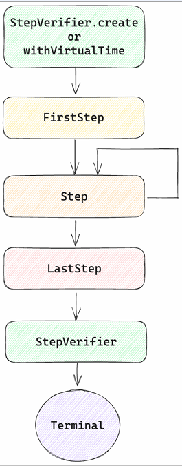

# Reactor test
JUnit으로 테스트를 작성하고, mockito 를 이용해서 mock 객체를 만들어서 일반적인 테스트를 작성할 수 있지만, 비동기 non-blocking 환경에서의 테스트는 불가능하다.  
비동기 non-blocking 테스트를 위해 Reactor에서는 Reactor-test 모드를 지원한다.  

# StepVerifier
 StepVerifier를 사용하면 Publisher가 제공하는 다양한 이벤트를 차례로 검증할 수 있고, Publisher를 create해서 테스트 환경을 준비한다. 그 후, 여러가지 메서드들을 체이닝해서 이벤트를 확인할 수 있다.  
 ````java
public class StepVerifierTest {

    @Test
    void test1() {
        Flux<Integer> flux = Flux.create(sink -> {
            for (int i = 0; i < 10; i++) {
                sink.next(i);
            }
            sink.complete();
        });
        // 테스트 환경 준비
        StepVerifier.create(flux)
                // subscribe가 일어났는지 검증
                .expectSubscription()
                // 10개의 값을 전달하는 flux에 대한 기대값 검증
                .expectNext(0, 1,2,3,4,5,6,7,8,9)
                // 값 전달이 끝나고 complete 되었는지 검증
                .expectComplete()
                // verify를 호출해야
                // 준비한 테스트 환경이 실행된다.
                .verify();
    }
}
````
StepVerifier는 각각 호출되는 메서드들을 하나의 스텝으로 구분한다.  
FirstStep, Step, LastStep으로 구성되며, FirstStep은 처음 받는 이벤트인 onSubscription과 관련되지만 명시적으로 반드시 실행하지 않고 생략도 가능하다.  
Step은 이후에 들어오는 이벤트들을 순차적으로 검증하며, Step에 데이터를 여러번 검증해야 하는 경우 여러번 자기 자신을 반복적으로 진행시킬 수 있다.  
LastStep은 최종 결과를 검증하고, 검증에 실패한다면 테스트가 실패되는 step이다.  
        
흐름을 정리하면 StepVerifier.create로 테스트 환경 구성을 시작하고 FirstStep으로 Subscribe, Step을 통해서 Next, LastStep을 통해서 complete나 에러 이벤트를 확인한 후 verify를 호출해서 테스트를 실행하고 검증 결과를 확인한다.  

## FirstStep
StepVerifier의 create static 메서드를 이용하여 FirstStep을 생성하며 추가로 Subscription에 전달할 request 수와 StepVerifierOptions를 지원하고 FirstStep은 Step을 상속하기 때문에 무시하고 바로 Step으로 넘어갈 수 있다.  
expectSubscription 메서드는 onSubscribe가 제대로 이루어졌는지 체크할 수 있는 메서드이며 onSubscribe 이벤트를 기대한다고 할 수 있다. expectSubscription은 Step을 반환하여 Step으로 넘어갈 수 있으며, FirstStep은 Step을 상속하기 때문에 expectSubscription을 호출하지 않고 바로 Step으로 넘어갈 수도 있다.  
````java
    static <T> FirstStep<T> create(Publisher<? extends T> publisher) {
        return create(publisher, Long.MAX_VALUE);
    }

    static <T> FirstStep<T> create(Publisher<? extends T> publisher, long n) {
        return create(publisher, StepVerifierOptions.create().initialRequest(n));
    }

    static <T> FirstStep<T> create(Publisher<? extends T> publisher, StepVerifierOptions options) {
        return DefaultStepVerifierBuilder.newVerifier(options, () -> {
            return publisher;
        });
    }

public interface FirstStep<T> extends Step<T> {
    Step<T> expectSubscription();
}
````
StepVerifierOptions는 일종의 옵션을 만들기 위한 빌더라고 생각하면 된다.
- initialRequest : Subscription에 전달할 request 수 제공
- withInitialContext : Context를 제공하여 초기 Context 설정  
- scenarioName : 시나리오 이름을 부여하여 assertion 에러 발생시 메세지에 노출한다.

````java
public class StepVerifierOptions {
    @Nullable
    private String scenarioName = null;

    private long initialRequest = Long.MAX_VALUE;
    private Context initialCOntext;
    
    public StepVerifierOptions initialRequest(long initialRequest) {
        this.initialRequest = initialRequest;
        return this;
    }
    
    public StepVerifierOptions withInitialContext(Context context) {
        this.initialRequest = context;
        return this;
    }
    public StepVerifierOptions scenarioName(@Nullable String scenarioName) {
        this.scenarioName = scenarioName;
        return this;
    }
}
````

````java
public class FirstStepExampleTest {
    @Test
    void test1() {
        var flux = Flux.range(0, 5);

        var options = StepVerifierOptions.create()
                .initialRequest(100)
                .withInitialContext(Context.empty())
                .scenarioName("test1");
        
        StepVerifier.create(flux, options)
                .expectSubscription()
                .expectNextCount(5)
                .verifyComplete();
    }
}
````
StepVerifierOptions.create를 이용해서 텅 빈 Options를 생성한다. 이후 initialRequest와 withInitialContext, scenarioName을 체이닝하여 request 수, 초기 Context, 시나리오 이름을 설정하고  
FirstStep에서 expectSubscription 실행 후 Step으로 이동한다. Step에서 expectNextCount를 통해서 5개의 onNext를 숨행하고 verifyComplete로 종료한다

## Step
FirstStep이 실행된 후 혹은 FirstStep을 생략하고 Step을 실행한다. Step의 메서드들은 대부분 실행 후 Step을 반환하기 때문에 다양한 조건을 검증할 수 있으며, Step은 LastStep을 구현하고 있기 때문에 Step 이후 바로 LastStep을 체이닝하여 LastStep으로 이동할 수 있다.  
````java
interface Step<T> extends LastStep {
    Step<T> expectNext(T t);
}
````
## Step onNext
onNext 이벤트로 전달되는 item들을 하나씩 검증하는 메서드들이다. 
1. assertNext : Consumer를 통해 item을 검증하며 문제가 있다면 JUnit의 Assertions 등을 통해서 AssertionErrors를 throw 한다.
2. expectNext : 한 개 이상의 item을 순서대로 비교하고 가변인자를 통해 여러 값을 전달할 수 있다.  
3. expectNextCount : 각각의 item을 검증하는 대신 count 만큼 onNext 이벤트가 발생하는지 검증한다.  
4. expectNextSequence : iterable의 element 들을 onNext로 전달되는 item들과 순서대로 비교한다.
5. expectNextMatches : onNext로 전달된 item을 인자로 받고 검증하여 boolean을 반환하고, 반환된 값이 true라면 통과한다

````java
import java.util.function.Predicate;

interface Step<T> extends LastStep {
    default Step<T> assertNext(COnsumer<? super T> assertionConsumer) {
        return consumeNextWith(assertionConsumer);
    }
    Step<T> expectNext(T t);
    Step<T> expectNext(T... t);
    Step<T> expectNextCount(long count);
    Step<T> expectNextSequence(Iterable<? extends T> iterable);
    Step<T> expectNextMatches(Predicate<? super T> predicate);
}
````
````java
public class StepOnNextExampleTest {

    @Test
    void test1(){
        // 총 10개의 item을 전달하는 Flux
        var flux = Flux.range(0,10);

        StepVerifier.create(flux)
                // COnsumer를 lamda 형태로 전달
                .assertNext(i -> {
                // assertNext가 호출된 시점엔
                // i는 0이다 -> 통과
                    assertEquals(0, i);
                })
                // 다음으로 온 값으 1, 2인지 체크
                .expectNext(1, 2)
                // 특정값이 아니라 다음 값의 갯수 체크
                // 3개의 값 3, 4, 5 consume  
                .expectNextCount(3)
                // 3, 4, 5 다음 값을 6,7,8 값을 가진 리스트와 비교
                .expectNextSequence(List.of(6,7,8))
                // 이 시점에 주어진 값이 9와 동일한지 체크
                // 비교하는 Predicate를 lambda 형태로 제공
                .expectNextMatches(i -> i == 9)
                // item을 모두 consume한 후 complete 이벤트 확인
                .expectComplete()
                .verify();
    }
}
```` 
## Step Context 
Publisher에 전파되는 Context를 검증할 수 있는 메서드를 제공한다.  
expectAccessibleContext : onSubscribe 이벤트 이후 전파된 Context가 있는지 검증하고, 전파된 Context가 없다면 테스트는 실패처리된다. ContextExpectations를 반환하여 Context와 관련된 추가 검증이 가능하다.  
expectNoAccessibleContext : onSubscribe 이벤트 이후 전파되는 Context가 없는지 검증하는데, 전파된 Context가 있다면 테스트는 실패 처리 된다.
````java
interface Step<T> extends LastStep {
    ContextExpectations<T> expectAccessibleContext();
    
    Step<T> expectNoAccessibleContext();
}
````
**ContextExpectations** 에서도 다양한 검증메서드를 제공한다.
````java
 public interface ContextExpectations<T> {
    
        // Context에 특정한 key를 갖는지 검증
        ContextExpectations<T> hasKey(Object var1);
        // 특정한 size를 갖는지 검증
        ContextExpectations<T> hasSize(int var1);
        // COntext에 특정한 key에 대한 값을 가지고 있는지 검증
        ContextExpectations<T> contains(Object var1, Object var2);
        // 다른 Context 혹은 Map에 포함된 값들을 모두 포함하는지 검증
        ContextExpectations<T> containsAllOf(Context var1);
        
        // 다른 Context, Map에 포함된 값들을 모두 포함하는지 검증.
        ContextExpectations<T> containsAllOf(Map<?, ?> var1);
        
        // 다른 Context, Map에 포함된 값들을 모두 포함하는지 검증
        // 그 이외의 값은 가지면 안된다.
        ContextExpectations<T> containsOnly(Context var1);
        
        // Consumer를 통해서 Context를 인자로 전달받고
        // JUnit의 Assertions 등을 통해서 비교
        ContextExpectations<T> assertThat(Consumer<Context> var1);
        
        // Context를 인자로 전달받고 기대와 일치하는 경우 
        // true를 반환하는 Predicate를 통해 검증 
        ContextExpectations<T> matches(Predicate<Context> var1);
        // ContextExpectations를 종료하고 Step으로 복귀한다.
        Step<T> then();
    }
````

````java
public class StepContextExampleTest {
    @Test
    void test1() {
        var flux = Flux.range(0, 5);

        StepVerifier.create(flux)
                .expectNoAccessibleContext()
                .expectNextCount(5)
                .verifyComplete();
    }

    @Test
    void test2() {
        var flux = Flux.range(0, 5)
                .contextWrite(Context.of("foo", "bar"));

        StepVerifier.create(flux)
                .expectAccessibleContext()
                .contains("foo", "bar").then()
                .expectNextCount(5)
                .verifyComplete();
    }

    @Test
    void test3() {
        var flux = Flux.range(0, 5);

        var options = StepVerifierOptions.create()
                .withInitialContext(Context.of("foo", "bar"));

        StepVerifier.create(flux, options)
                .expectAccessibleContext()
                .contains("foo", "bar").then()
                .expectNextCount(5)
                .verifyComplete();
    }
}
````
test1에서는 Context가 전파되지 않기 때문에 expectNoAccessibleContext는 당연히 통과되며, test2에서는 contextWrite을 통해서 Context를 생성해서 expectAccessibleContext가 통과되고 contains를 통해서 기대하는 값이 존재하는지 확인한다.  
test3에서는 StepVerifierOptions를 통해 Context를 주입하고 StepVerifierOptions를 통해 Context를 주입하는 것은 subscribe 에서 Context를 주입하는 것과 비슷하다.

## Step 유틸리티 메서드
Step에서는 다양한 유틸성 메서드도 같이 제공한다.  
as 메서드는 이전 step에 description을 추가한다. 테스트 실패시 as에 넘겨진 description이 로그에 추가된다.  
then 메서드는 이전 step 이후 Runnable 코드를 실행한다.  
thenRequest 메서드는 추가로 n만큼 request한다. 처음에 request를 제한적으로 했다면 이후 thenRequest를 통해서 추가적으로 item을 요청할 수 있다.

````java
interface Step<T> extends LastStep {
    Step<T> as(String description);
    Step<T> then(Runnable task);
    Step<T> thenRequest(long n);
}
````

## LastStep
LastStep은 가장 마지막에 호출되어 최종 상태를 확인할 수 있다. Step은 LastStep을 상속하기 떄문에 Step 단계에서 LastStep의 메서드를 호출하여 검증을 종료할 수 있다.  

## LastStep expectError
최종단계에서 에러 이벤트가 발생했는지, 발생했다면 어떤 조건으로 발생했고 어떤 값을 갖고 있었는지 체크할 수 있다.  
Publisher가 onError를 전달하는 것을 기대하는 경우에 사용하며 consumeErrorWith 혹은 expectError*를 호출한다.    
ConsumeErrorWith : Consumer를 전달하여 Consumer 내부에서 검증한다.  
expectError : onError 이벤트가 전달됐는지 검증하며, Class를 전달하여 특정 타입의 Error가 전달되었는지 확인 가능하다.  
expectErrorMessage : onError 이벤트로 전달된 Error의 message를 비교한다.  
expectErrorMatches : Predicate를 전달하여 true가 반환되면 통과하고 아니라면 실패처리한다.  
expectErrorSatisfies : consumeErrorWith와 동일하다.  

LastStep으로 검증한 후 반드시 verify를 호출해야한다.
````java
    public interface LastStep {
    StepVerifier consumeErrorWith(Consumer<Throwable> var1);

    StepVerifier expectError();

    StepVerifier expectError(Class<? extends Throwable> var1);

    StepVerifier expectErrorMessage(String var1);

    StepVerifier expectErrorMatches(Predicate<Throwable> var1);

    StepVerifier expectErrorSatisfies(Consumer<Throwable> var1);
}

public interface StepVerifier {
    Duration verify() throws AssertionError;
}
````
````java
public class LastStepExpectErrorExampleTest {
    @Test
    void test1() {
        var flux = Flux.error(new IllegalStateException());
        StepVerifier.create(flux)
                .expectError()
                .verify();
    }

    @Test
    void test2() {
        var flux = Flux.error(new IllegalStateException());
        StepVerifier.create(flux)
                .expectError(IllegalStateException.class)
                .verify();
    }

    @Test
    void test3() {
        var message = "custom message";
        var flux = Flux.error(new IllegalStateException(message));
        StepVerifier.create(flux)
                .expectErrorMessage(message)
                .verify();
    }

    @Test
    void test4() {
        var flux = Flux.error(new IllegalStateException("hello"));
        StepVerifier.create(flux)
                .expectErrorMatches(e ->
                        e instanceof IllegalStateException &&
                                e.getMessage().equals("hello"))
                .verify();
    }

    @Test
    void test5() {
        var flux = Flux.error(new IllegalStateException("hello"));
        StepVerifier.create(flux)
                .expectErrorSatisfies(e -> {
                    assertInstanceOf(IllegalStateException.class, e);
                    assertEquals("hello", e.getMessage());
                })
                .verify();
    }
}
````
expectError를 통해 onError 이벤트가 전달되는 것을 검증한다. expectError에 Throwable Class를 전달하여 특정 타입의 Error가 throw되는지 검증하고 expectErrorMessage를 통해 특정 메세지를 가진 Error가 전달되는지 검증한다.  
expectErrorMatches에 Predicate를 lambda로 전달하여 조건을 충족하는지 boolean으로 반환하고, expectErrorSatisfies에 Consumer를 lambda로 전달하여 조건을 충족하는지 assert를 통해서 검증한다.  

## LastStep expectTimeout
onNext혹은 onComplete 이벤트가 주어진 duration 동안 발생하지 않기를 기대한다. 이때 StepVerifier를 반환하기 떄문에 명시적으로 verify를 호출해야 한다.

````java
import java.time.Duration;

interface LastStep {
    StepVerifier expectTimeout(Duration duration);
}
````
````java
public class LastStepExpectTimeoutExampleTest {
    @Test
    void test1() {
        var mono = Mono.delay(Duration.ofMillis(500));

        StepVerifier.create(mono)
                .expectTimeout(Duration.ofMillis(100))
                .verify();
    }

    @TestToFail
    void test2() {
        var mono = Mono.delay(Duration.ofMillis(100));

        StepVerifier.create(mono)
                .expectTimeout(Duration.ofSeconds(1))
                .verify();
    }

    @Test
    void test3() {
        var flux = Flux.range(0, 10)
                .delayElements(Duration.ofMillis(500));

        StepVerifier.create(flux)
                .expectTimeout(Duration.ofMillis(100))
                .verify();
    }
}
````
test1에서 500ms 이후 onNext로 0을 전달한다. 100ms 동안 onNext가 전달되지 않아서 테스트는 통과되며, test2에서는 100ms 이후 onNext로 0을 전달한다. 1초가 지나기 전에 onNext로 0이 전달되어 테스트는 실패한다.  
test3에서는 Flux이고 onSubscribe 이후 첫 onNext 사이의 간격을 측정한다. 100ms 동안 onNext가 발생하지 않아서 테스트는 통과되고 Flux의 경우 첫 onNext 발생 시점이 중요하다.   

## LastStep expectComplete
onComplete 이벤트가 전달되기를 기대하는 메서드이며, StepVerifier를 반환하기 떄문에 명시적으로 verify를 호출해야한다.
````java
interface LastStep {
    StepVerifier expectComplete();
}
````
````java
public class LastStepExpectCompleteExampleTest {
    @Test
    void test1() {
        var flux = Flux.range(0, 5);

        StepVerifier.create(flux)
                .expectNextCount(5)
                .expectComplete()
                .verify();
    }
    
    @TestToFail
    void test2() {
        var flux = Flux.error(new IllegalStateException());
        StepVerifier.create(flux)
                .expectComplete()
                .verify();
    }
}
````
test1에서는 expectNextCount를 통해서 모든 onNext 이벤트를 consume하고 expectComplete를 통해서 onComplete 이벤트 전달을 검증하고, test2에서는 Publisher(Flux) 에 Exception을 전달했기 때문에 complete 이벤트는 발생하지 않는다.  

## LastStep thenCancel 
이벤트를 전달받는 중간에 thenCancel을 호출하여 중간에 subscribe를 cancel할 수 있다. Subscription.cancel을 호출하는 것과 동일하다.
error나 complete가 아닌 중간에 종료된다.   
````java
interface LastStep {
    StepVerifier thenCancel();
}
````
````java
@Slf4j
public class LastStepThenCancelExampleTest {
    @Test
    void test1() {
        var flux = Flux.range(0, 5)
                .doOnNext(i -> log.info("next: {}", i));

        StepVerifier.create(flux)
                .expectNextCount(3)
                .thenCancel()
                .verify();
    }
}
````
flux에서는 5개의 item을 onNext로 전달하지만 thenCancel을 통해서 3개의 item을 전달한 후 subscribe를 종료한다.  

## LastStep verify*
expectError* , expectComplete 등을 매번 호출하고, verify 까지 매번 같이 호출하는건 개발자가 실수할수도있고 번거롭다.  
Reactor test는 단축 메서드를 제공한다.  
verifyError의 경우, expectError().verify()와 동일하다. 나머지도 메서드 이름을 보면 유추가 가능하며, Duration을 반환하여 전체 검증에 얼마만큼의 시간이 소모되었는지 확인 가능하다.  
````java
        Duration verifyError();

        Duration verifyError(Class<? extends Throwable> var1);

        Duration verifyErrorMessage(String var1);

        Duration verifyErrorMatches(Predicate<Throwable> var1);

        default Duration verifyTimeout(Duration duration) {
            return this.expectTimeout(duration).verify();
        }

        Duration verifyErrorSatisfies(Consumer<Throwable> var1);

        Duration verifyComplete();
````
````java
public class LastStepVerifyExampleTest {
    @Test
    void test1() {
        var err = new IllegalStateException("hello");
        StepVerifier.create(Mono.error(err))
                .verifyErrorMessage("hello");
    }

    @Test
    public void test2() {
        StepVerifier.create(Mono.just(1))
                .expectNext(1)
                .verifyComplete();
    }

    @Test
    void test3() {
        var mono = Mono.delay(Duration.ofMillis(500));
        StepVerifier.create(mono)
                .verifyTimeout(Duration.ofMillis(100));
    }
}
````
# StepVerifier
StepVerifier는 create static 메서드 뿐만 아니라 자체적인 메서드를 포함한다. verify 메서드는 호출되는 시점부터 Publisher에 대한 검증 시작, onComplete, onError 이벤트가 발생하거나 cancel되면 block을 해제하며 기본적으로 timeout 없이 계속 기다린다. Duration을 제공하여 특정 시간동안만 block하게 만들 수 있다.  
verifyThenAssertThat 메서드는 verify와 동일하게 Publisher를 검증하고 Assertions를 반환하여 모든 이벤트가 종료된 시점에서 추가 검증이 가능하다. Duration을 제공하여 특정 시간동안만 block하게끔 설정할수도 있다.  
````java
    StepVerifier log();

    Duration verify() throws AssertionError;

    Duration verify(Duration var1) throws AssertionError;

    Assertions verifyThenAssertThat();

    Assertions verifyThenAssertThat(Duration var1);
````
## Assertions 
droppedElements 존재 여부, droppedErrors 존재 여부, OperatorErrors 존재 여부를 검증하며, 전체 소요 시간을 검증한다.  
````java
interface Assertions {
    Assertions hasDroppedElements();
    
    Assertions hasNotDroppedElements();
    
    Assertions hasDropped(Object... values);
    
    Assertions hasDroppedErrors();
    
    Assertions hasOperatorErrors();
    
    Assertions tookLessThan(Duration d);
    
    Assertions tookMoreThan(Duration d);
}
````
````java
public class StepVerifierVerifyTest {
    @Test
    void test1() {
        StepVerifier
                .create(Flux.just(1, 2, 3))
                .expectNextCount(3)
                .expectComplete()
                .log()
                .verify();
    }

    @Test
    void test2() {
        var duration = Duration.ofSeconds(1);
        StepVerifier
                .create(Flux.just(1, 2, 3))
                .expectNextCount(3)
                .expectComplete()
                .log()
                .verifyThenAssertThat(duration)
                .tookLessThan(duration)
                .hasNotDroppedElements();
    }
}
````
log를 통해서 자세한 테스트 정보를 log로 남길 수 있고, verifyThenAssertThat에 Duration을 전달하여 특정 Duration 동안만 스레드를 block 시킬 수 있다.  
반환된 Assertions에 대해서 tookLessThan과 hasNotDroppedElements를 이용하여 추가 검증 가능하다.

# withVirtualTime
만약 Mono에 1시간 delay로 테스트를 진행하거나, Flux가 10개의 item을 갖는데 delayElements를 통해 10초 간격을 갖는 테스틀 진행한다면, 테스트 실행에 당연히 지연이 생기게 된다.   
시간과 관련된 기능을 지원하기 위해 create static 메서드와 비슷하게 생긴 withVirtualTime을 제공한다.  
withVirtualTime으로 FirstStep을 생성하면 기존의 Scheduler를 VirtualTimeScheduler로 대체하며, VirtualTimeScheduler는 delay와 관련된 함수들을 실제로 대기하는 대신 건너뛸 수 있는 기능을 제공하고 
직접 Publisher를 반환하는 대신 Supplier를 전달하고 해당 Supplier에서 Publisher를 반환한다.
````java
    static <T> FirstStep<T> withVirtualTime(Supplier<? extends Publisher<? extends T>> scenarioSupplier) {
        return withVirtualTime(scenarioSupplier, Long.MAX_VALUE);
    }

    static <T> FirstStep<T> withVirtualTime(Supplier<? extends Publisher<? extends T>> scenarioSupplier, long n) {
        return withVirtualTime(scenarioSupplier, () -> {
            return VirtualTimeScheduler.getOrSet(true);
        }, n);
    }

    static <T> FirstStep<T> withVirtualTime(Supplier<? extends Publisher<? extends T>> scenarioSupplier, Supplier<? extends VirtualTimeScheduler> vtsLookup, long n) {
        return withVirtualTime(scenarioSupplier, StepVerifierOptions.create().initialRequest(n).virtualTimeSchedulerSupplier(vtsLookup));
    }

    static <T> FirstStep<T> withVirtualTime(Supplier<? extends Publisher<? extends T>> scenarioSupplier, StepVerifierOptions options) {
        DefaultStepVerifierBuilder.checkPositive(options.getInitialRequest());
        Objects.requireNonNull(scenarioSupplier, "scenarioSupplier");
        if (options.getVirtualTimeSchedulerSupplier() == null) {
            options = options.copy().virtualTimeSchedulerSupplier(() -> {
                return VirtualTimeScheduler.getOrSet(true);
            });
        }

        return DefaultStepVerifierBuilder.newVerifier(options, scenarioSupplier);
    }
````
````java
public class FirstStepWithVirtualTimeExampleTest {
    @Test
    void test1() {
        StepVerifier.withVirtualTime(() -> {
            // 반드시 supplier 형태로 전달해야만 정상적으로 동작한다.
                    return Flux.range(0, 5);
                })
                .expectNextCount(5)
                .verifyComplete();
    }

    @Test
    void test2() {
        var flux = Flux.range(0, 5)
                .delayElements(Duration.ofSeconds(1));

        StepVerifier.withVirtualTime(() -> flux)
                .thenAwait(Duration.ofSeconds(5))
                .expectNextCount(5)
                .verifyComplete();
    }
}
````
first step을 withVirtualTime으로 생성한다.  
create static 메서드와 비슷하지만 Publisher를 직접 제공하지 않고 Supplier를 lambda 형태로 전달하여 Publisher를 반환한다.  
만약 Supplier 바깥에서 Flux를 만들고 생성된 flux를 전달하면 제대로 동작하지 않는다.  

## Step과 time 
WithVirtualTime과 함께 Step의 thenAwait과 expectNoEvent를 사용하여 시너지를 낼 수 있다.  
thenAwait 메서드는 주어진 시간을 대기한다. withVirtualTIme과 함께 사용되어 실제 시간을 기다리는 대신 건너뛰며, expectNoEvent 메서드는 주어진 시간동안 이벤트가 발생하지 않기를 기대하며, 실제 시간을 기다리는 대신 주어진 시간을 건너뛰고 그동안 이벤트가 발생했는지를 검증할 수 있다.
````java
interface Step<T> extends LasStep {
    Step<T> thenAwait(Duration var1);
    Step<T> expectNoEvent(Duration var1);    
}
````
````java
public class WithVirtualTimeTest {
    @Test
    void test1() {
        StepVerifier.withVirtualTime(() -> {
                    return Flux.range(0, 5)
                            .delayElements(Duration.ofHours(1));
                })
                .thenAwait(Duration.ofHours(2))
                .expectNextCount(2)
                .thenAwait(Duration.ofHours(3))
                .expectNextCount(3)
                .verifyComplete();
    }

    @Test
    void test2() {
        StepVerifier.withVirtualTime(() -> {
                    return Mono.delay(Duration.ofDays(10));
                })
                .expectSubscription()
                .expectNoEvent(Duration.ofDays(9))
                .thenAwait(Duration.ofDays(1))
                .expectNext(0L)
                .verifyComplete();
    }
}
````
1시간 간격으로 0부터 4까지의 값을 전달하는 Flux를 생성하고 withVirtualTime으로 wrapping, thenAwait을 이용해서 2시간 대기 후 expectNextCount(2)를 호출한다. 다시 3시간 대기 후 expectNextCount(3)을 호출한다.  
시간단위로 테스트가 작성되었어도 실제 테스트는 1초 정도 소요되고 종료된다.  
10일 이후 0을 전달하는 Mono를 생성한다. 9일동안 어떤 이벤트도 발생하지 않는 것을 확인하고 1일 대기 후 expectNext(0L)을 호출, 실제 테스트 소요시간은 마찬가지로 1초 내외로 종료된다.  

# TestPublisher 
Subscriber를 검증하기 위해선 당연히 Publisher가 필요하다. Publisher를 직접 구현하는 대신 TestPublisher를 사용하면 쉽게 테스트가 가능하고, create 메서드를 사용해서 TestPublisher를 생성할 수 있다.  
TestPublisher는 next, error, complete, emit 등의 이벤트 생성 메서드를 제공한다.  
next: 주어진 인자를 기반으로 onNext 이벤트를 전달한다. 여러 값을 가변인자로 받는 경우 차례대로 전달한다.  
error : 주어진 Throwable로 onError 이벤트를 전달한다.  
compelte : onComplete 이벤트를 전달한다.  
emit : 주어진 값들로 차례로 onNext 이벤트를 전달하고 onComplete 이벤트를 전달한다.

````java
import reactor.util.annotation.Nullable;

public abstract TestPublisher<T> next(@Nullable T value);
public abstract TestPublisher<T> error(Throwable t);
public abstract TestPublisher<T> complete();
public final TestPublisher<T> next(@Nullable T first, T... rest) {
    /*do something*/
}
public final TestPublisher<T> emit(T... values) {
    /*do something*/
}
````
````java

public class TestPublisherSignalExampleTest {
    @Test
    void test1() {
        var testPublisher = TestPublisher.create();

        StepVerifier.create(testPublisher)
                .then(() -> testPublisher.next(1, 2, 3))
                .expectNext(1, 2, 3)
                .then(() -> testPublisher.complete())
                .verifyComplete();
    }

    @Test
    void test2() {
        var testPublisher = TestPublisher.create();

        var error = new IllegalStateException("test");
        StepVerifier.create(testPublisher)
                .then(() -> testPublisher.error(error))
                .verifyErrorMatches(it -> it == error);
    }

    @Test
    void test3() {
        var testPublisher = TestPublisher.create();

        StepVerifier.create(testPublisher)
                .then(() -> testPublisher.emit(1, 2, 3))
                .expectNext(1, 2, 3)
                .verifyComplete();
    }
}
````
then Step을 사용하면 expect*를 실행하기 전 특정 동작을 수행할 수 있고, test1에서 next(1,2,3)을 수행한다 이때, expectNext로 onNext 이벤트를 전달 및 검증하며 이후 complete를 호출하여 onComplete 이벤트를 검증한다.  
test2에서는 error를 수행하여 verifyErrorMatches로 검증하고, test3에서는 emit(1,2,3)을 수행하여 onNext 이벤트를 3번 전달하고 onComplete를 수행한다. 

## TestPublisher assert
TestPublisher의 상태를 검증할 수 있는 메서드도 같이 제공된다. 
````java
    // 모든 subscriber들이 주어진 n 이상으로 request 했는지 검증
    public abstract TestPublisher<T> assertMinRequested(long var1);
    // 모든 subscriber들이 주어진 n 이하로 reqeust 했는지 검증
    public abstract TestPublisher<T> assertMaxRequested(long var1);
    
    // subscriber를 갖는지 검증
    // n을 넘겨 정확한 갯수도 검증 가능 
    public abstract TestPublisher<T> assertSubscribers();
    public abstract TestPublisher<T> assertSubscribers(int var1);
    
    // subscriber가 없는지 검증
    public abstract TestPublisher<T> assertNoSubscribers();
    
    // cancel된 적이 있는지 검증
    // n을 같이 넘겨서 정확한 횟수도 검증
    public abstract TestPublisher<T> assertCancelled();
    public abstract TestPublisher<T> assertCancelled(int var1);

    // cancel된 적이 없는지 검증한다.
    public abstract TestPublisher<T> assertNotCancelled();
````
````java
public class TestPublisherAssertTest {
    @Test
    void test1() {
        TestPublisher<Integer> testPublisher = TestPublisher.create();

        testPublisher.subscribe(new Subscriber() {
            @Override
            public void onSubscribe(Subscription s) {
                s.request(5);
            }

            @Override public void onNext(Object o) { }
            @Override public void onError(Throwable t) { }
            @Override public void onComplete() { }
        });
        testPublisher.assertSubscribers(1);
        testPublisher.assertWasRequested();
        testPublisher.assertMinRequested(5);
        testPublisher.assertMaxRequested(5);

        testPublisher.emit(1, 2, 3);
        testPublisher.assertNoSubscribers();
        testPublisher.assertWasNotCancelled();
    }
}
````
Subscriber를 생성하여 subscribe에 제공한다. subscribe 직후 TestPublisher가 이벤트를 전달하기 이전 1개의 Subscriber를 가지고 있다, 5개만큼 request 되었다를 검증한다.  
emit을 통해 3개의 값을 Subscriber에게 전달 후 complete를 호출하고 complete 되었기 떄문에 더 이상 Subscriber를 갖지 않는지 체크한다. 한번도 취소된 적이 없기 때문에 wasNotCancelled는 통과된다. 
